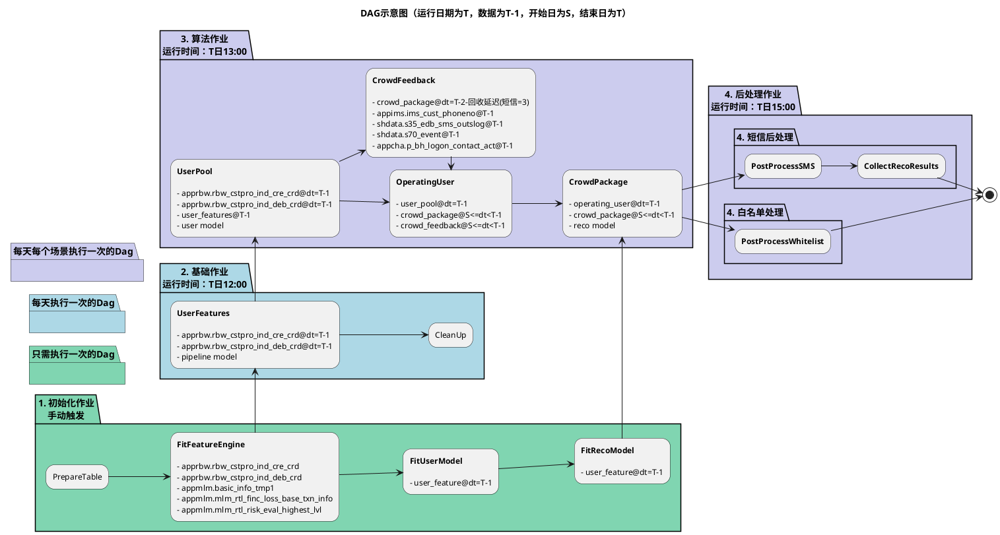

# 离线推荐任务

## 语义说明

- `T-2`：是指所有推荐结果计算用的数据，相对于实际投放，是落后两天的，举个例子：
  - 2022-01-01 日，上游数据回收
  - 2022-01-02 日 07:00:00 时，完成对 2022-01-01 日数据的所有跑批任务
  - 2022-01-02 日 09:00:00 时，调度平台上的 DAG 启动，此时 batch_id=20220101，所有计算均是用的昨天的数据
  - 2022-01-03 日，下游 BI 平台调用场景列表接口，获取 batch_id=20220101 的场景列表，并且去拿对应的名单文件
- `DAG`: 一堆 SparkJob 的总和，
  - 对一波人（比如一个分行、一个客群等），用一个模型，生成(`user_id`, `item_id`) 的 pair，一个DAG只能属于一个场景
- `场景(Scene)`：对使用同一模型/配置的 DAG 的总称，比如信用卡促活场景、借记卡获客场景，一个场景包括多个 DAG
  - 每个场景有场景配置（SceneConfig），将作为该场景下所有 DAG 的默认配置
- `活动(Activity)`：指定栏位下的投放配置，包括渠道栏位、场景等，列表接口将提供给BI
  - 一个活动应当尽量涵盖所有可触达用户，即输入每一个`user_id`，都可以至少一个场景产出的推荐结果。
  - 比如APP弹窗栏位的活动，包括信用卡获客场景（裸借记卡）、借记卡获客场景（裸信用卡）、双卡促活场景（共同持卡），这三个场景涵盖所有安装手机银行的用户。
  - 一个活动包含多个场景，一个场景也可以属于多个活动
- `栏位渠道channel+Banner`，定义同 BI，渠道栏位和活动一一对应
  - 每个渠道栏位对应一个后处理 DAG（PostProcDag)，后处理DAG的上游是各个场景的推荐DAG（RecoDag）
  - 后处理DAG对推荐DAG的结果进行合并，组装为该渠道下游需要的格式（比如短信需要手机号），最后同步至文件传输服务。

## 配置变更方法

见 [demo](http://172.18.192.89:38085)

变更完后，针对每个dag，要重新执行 GenDagConfig Job

## 运行流程

## 注意事项

1. 和招总项目不同之处：
  - 配置不存hive，存mysql，entrypoint 启动时获取，传给 spark-submit
  - 所有存的 batch\_id 均是以数据实际日期为准，而非程序运行时间，对算法作业没影响，对回收作业，7号跑，回收6号投放的数据（招总batch\_id=6，对应算法作业batch_id=4），本项目回收作业batch\_id依然为4号，7号跑的时候用4号的配置，回收6号的结果，存4号的分区），但是要带上执行时间
